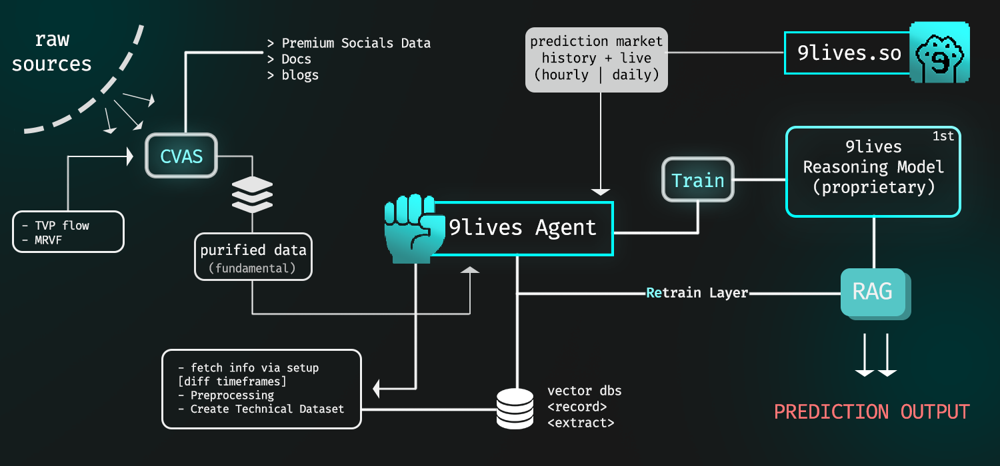

# WowFi Funding Proposal(9lives-agent)

## Core Vision

WowFi operates across three interconnected verticals:

1. **Crypto Currencies** → Trading intelligence
2. **Projects** → Discovery and investment analysis
3. **9Lives Agent** → Prediction market model *(Priority One)*

The 9Lives Agent is our differentiator—simultaneously a proprietary reasoning engine and an integrated real-time prediction tool.

---

## The 9Lives Agent

An autonomous prediction system operating on high-impact assets (BTC, GOLD, MONAD, NVIDIA) with hourly and daily market resolutions via 9lives.so.

### What Makes It Unique

**CVAS Pipeline** (Cross-Validation Analysis Stack)
- Aggregates and filters global data sources
- Delivers 100% verified, noise-free information
- Feeds both fundamental analysis and technical patterns into our reasoning model

**Superior Data Quality**
- Economic indicators and sentiment without noise
- Price patterns, volume trends, and volatility models
- Significantly outperforms generic market agents

---

## How It Works

**1. Data Ingestion**  
Agent tracks real-time market events aligned with 9lives prediction markets.

**2. Vector Database Storage**  
Converts records into scalable, queryable format. Performance compounds over time.

**3. RAG-Powered Predictions**  
Users query the agent through a Copilot-like interface and receive probabilistic outputs:  
*"70% chance BTC hits $X in the next hour"*

**4. Continuous Retraining**  
Every prediction outcome—win or loss—triggers model retraining.

- **24 hourly markets + 1 daily market = 25 training sessions per day**
- **750 training cycles per month**, fed by cleaned fundamental, social, and technical data
- **The model strengthens exponentially with each cycle**

---

## The Competitive Advantage

We're delivering Kaito Pro-level intelligence to everyone, for free.

While competitors charge for basic insights, WowFi provides:
- Clean, verified data via CVAS
- Real-time prediction capabilities
- Self-improving AI through continuous retraining

**Result:** A moat that widens daily as our model learns from every market cycle.

---

## Growth Engine

**Three-Pillar Ecosystem**

1. **User Acquisition**  
Users discover genuine Web3 opportunities through our Crypto and Projects verticals.

2. **9Lives Integration**  
Users find the reasoning agent, begin trading on 9lives.so markets, creating reciprocal growth.

3. **Network Effect**  
WowFi bridges 9Lives traders with information seekers, expanding both user bases simultaneously.

**The better CVAS and the agent perform, the faster we grow.**

---

## Future Development

**Phase 1:** Real-time prediction tool integration (in progress)

**Phase 2:** Official 9lives.so collaboration for auto-trading agent

**Phase 3:** Expanded asset coverage and institutional partnerships

---

**Market Timing**  
Prediction markets are exploding. We're building the infrastructure layer.

**Defensible Moat**  
750+ monthly training cycles create a compounding advantage competitors cannot replicate.

**Clear Monetization**  
Free tools drive user acquisition. Premium features and API access provide revenue streams.

**Proven Traction**  
Architecture built. CVAS operational. Agent live in testing.

---

## Technical Architecture

[Reference diagram: CVAS data flow → 9Lives Agent → RAG reasoning → Prediction output with continuous retraining loop]

Full technical documentation: http://docs.wowfi.xyz/docs/features/9lives-agent

---

**We're not building another trading bot. We're building the intelligence layer for the next generation of prediction markets.**
